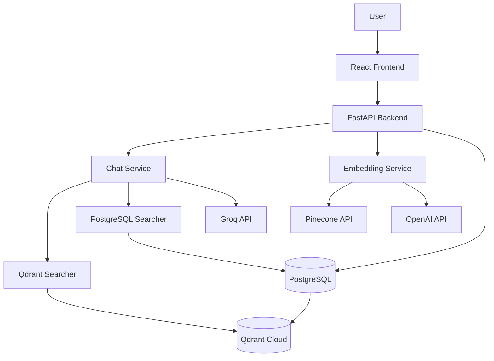

# Company Search & Ranking System with Hybrid Search


## Overview
This application implements an advanced company search and ranking system using a hybrid search approach that combines vector similarity search and traditional full-text search. The system supports two vector database options: PostgreSQL with PgVector extension for integrated storage, or Qdrant Cloud for specialized vector search performance. This dual approach ensures both semantic relevance and keyword accuracy in search results, making it particularly effective for company discovery and ranking.

## Description
The system leverages a sophisticated hybrid search architecture that:
- Uses OpenAI or Pinecone embeddings to convert company descriptions into vector representations
- Supports dual vector database options: PostgreSQL with PgVector or Qdrant Cloud
- Implements PostgreSQL's full-text search capabilities for keyword matching
- Combines both approaches with a weighted scoring system for optimal ranking
- Utilizes GPT-4o or Groq's LLaMA models for intelligent search result processing and summarization
- Utilizes Redis for caching frequently accessed data to improve performance
- Automatic synchronization between PostgreSQL and Qdrant when using Qdrant mode

This hybrid approach provides more accurate and contextually relevant results compared to traditional keyword-only search systems.

## Technologies Used
- **Backend**: FastAPI
- **Database**: PostgreSQL with pgvector extension, Qdrant Cloud, Redis for caching
- **Vector Embeddings**: OpenAI API / Pinecone Inference API
- **LLM Processing**: OpenAI GPT-4o / Groq LLaMA models
- **Frontend**: React
- **Containerization**: Docker
- **ORM**: SQLAlchemy

## Key Features
- Hybrid search combining vector similarity and full-text search
- Dual vector database support (PostgreSQL PgVector or Qdrant Cloud)
- Real-time company ranking based on search relevance
- Company information management (add/search) and retrieval
- Automatic data synchronization between PostgreSQL and Qdrant
- LLM powered tool calling
- Docker-based application deployment
- Flexible embedding options (OpenAI or Pinecone)
- Choice of LLM providers (OpenAI or Groq)

## Getting Started

### Prerequisites
- Docker and Docker Compose
- OpenAI API key (for OpenAI embeddings and LLM processing)
- Pinecone API key (for Pinecone embeddings)
- Groq API key (for Groq LLM models)
- Qdrant Cloud account and API key (optional, for Qdrant vector database)

### Environment Setup

1. Create a `.env` file in the Backend directory with the following variables:
   ```bash
   DATABASE_NAME=your_database_name
   DATABASE_USER=your_database_user
   DATABASE_PASSWORD=your_database_password
   DATABASE_URL=localhost
   DATABASE_PORT=5432
   OPENAI_API_KEY=your_openai_api_key
   PINECONE_API_KEY=your_pinecone_api_key
   GROQ_API_KEY=your_groq_api_key
   
   # Qdrant Configuration (Optional - for Qdrant Cloud)
   QDRANT_API_KEY=your_qdrant_api_key
   QDRANT_URL=https://your-cluster.qdrant.io
   QDRANT_COLLECTION_NAME=companies
   ```

### Quick Start with Docker Compose

1. Clone the repository:
   ```bash
   git clone https://github.com/Syed007Hassan/Investment-Search.git
   cd Backend
   ```

2. Build and start the containers:
   ```bash
   docker-compose up --build
   ```
3. Access the application:
   - Frontend: http://localhost:3000
   - Backend API: http://localhost:8000

### Database Setup Options

The application provides several options for database setup:

1. **Reset Database and Load Sample Data**:
   ```yaml
   command: >
     bash -c "
       python scripts/reset_db.py &&
       python scripts/load_data.py &&
       uvicorn main:app --host 0.0.0.0 --port 8000 --reload
     "
   ```

2. **Load Sample Data Only**:
   ```yaml
   command: >
     bash -c "
       python scripts/load_data.py &&
       uvicorn main:app --host 0.0.0.0 --port 8000 --reload
     "
   ```

3. **Start Application Only**:
   ```yaml
   command: uvicorn main:app --host 0.0.0.0 --port 8000 --reload
   ```

## Technical Implementation

### System Architecture

The system follows a microservices architecture with flexible vector database options:



#### Architecture Components:

1. **Frontend Layer**: React-based user interface
2. **API Layer**: FastAPI backend with REST endpoints
3. **Service Layer**: Modular services for different functionalities
4. **Data Layer**: Flexible database options with automatic synchronization
5. **External APIs**: Third-party services for embeddings and LLM processing

#### Data Flow:

**Adding Companies:**
1. Company data → PostgreSQL (with embeddings)
2. Auto-sync → Qdrant (when enabled)

**Search Process:**
1. User query → Embedding generation
2. Vector search → Qdrant or PostgreSQL
3. Results → LLM processing
4. Final response → User

### Hybrid Search Architecture

The system implements a sophisticated hybrid search approach combining two powerful search methodologies with flexible vector database options:

1. **Vector Similarity Search (Semantic Search)**
   - Uses either:
     - OpenAI's text-embedding-3-small model (1536-dimensional vectors)
     - Pinecone's multilingual-e5-large model (1024-dimensional vectors)
   - Vector storage options:
     - PostgreSQL with pgvector extension (integrated approach)
     - Qdrant Cloud (specialized vector database for high performance)
   - Enables semantic understanding of search queries
   - Automatic synchronization between PostgreSQL and Qdrant when using Qdrant mode

2. **Full-Text Search (Keyword Search)**
   - Utilizes PostgreSQL's built-in full-text search capabilities
   - Performs exact and partial keyword matching

3. **Vector Database Configuration**
   - Configure in `services/chat.py`:
     - `use_qdrant = True`: Uses Qdrant Cloud for vector search
     - `use_postgres = True`: Uses PostgreSQL pgvector for vector search
   - PostgreSQL always serves as the primary data store
   - Qdrant acts as a specialized search index when enabled

### Embedding Options

The system supports two embedding providers:

1. **OpenAI Embeddings**
   - Model: text-embedding-3-small
   - Dimensions: 1536
   - Advantages: High accuracy, well-suited for English language content

2. **Pinecone Embeddings**
   - Model: multilingual-e5-large
   - Dimensions: 1024
   - Advantages: Multilingual support, open-source model, cost-effective

The system automatically falls back to the alternative provider if one fails, ensuring robustness.

### LLM Processing Options

For search result processing and summarization, the system supports:

1. **OpenAI GPT Models**
   - Model: gpt-4o-2024-08-06
   - Advantages: High accuracy, advanced reasoning capabilities

2. **Groq LLaMA Models**
   - Model: llama-3.3-70b-versatile
   - Advantages: Fast inference, cost-effective, open-source architecture

### Search & Ranking Process

Let's break down this hybrid search query step by step:

1. **First CTE (Common Table Expression) - Vector Search:**
   ```sql
   WITH vector_search AS (
       SELECT id, 
              RANK () OVER (ORDER BY embedding <=> :embedding) AS rank
       FROM "Company"
       ORDER BY embedding <=> :embedding
       LIMIT 20
   )
   ```
   - Creates a temporary result set named `vector_search`
   - `embedding <=> :embedding`: Calculates cosine distance between stored embeddings and query embedding
   - `RANK() OVER`: Assigns ranks based on similarity (lower distance = better rank)
   - `LIMIT 20`: Takes top 20 most similar vectors
   - Vector distance ranges from 0-2, where 0 means vectors are identical and 2 means opposite

2. **Second CTE - Full-text Search:**
   ```sql
   fulltext_search AS (
       SELECT id, 
              RANK () OVER (ORDER BY ts_rank_cd(to_tsvector('english', content), query) DESC) 
       FROM "Company", 
            plainto_tsquery('english', :query) query
       WHERE to_tsvector('english', content) @@ query
       ORDER BY ts_rank_cd(to_tsvector('english', content), query) DESC
       LIMIT 20
   )
   ```
   - Creates another temporary result set named `fulltext_search`
   - `to_tsvector('english', content)`: Converts content to searchable tokens
   - `plainto_tsquery('english', :query)`: Converts search query to search terms
   - `@@`: Text search match operator
   - `ts_rank_cd`: Calculates text search relevancy score (higher score means better match)
   - `LIMIT 20`: Takes top 20 best text matches

3. **Final Combined Query:**
   ```sql
   SELECT
       COALESCE(vector_search.id, fulltext_search.id) AS id,
       COALESCE(1.0 / (:k + vector_search.rank), 0.0) +
       COALESCE(1.0 / (:k + fulltext_search.rank), 0.0) AS score
   FROM vector_search
   FULL OUTER JOIN fulltext_search ON vector_search.id = fulltext_search.id
   ORDER BY score DESC
   LIMIT 20
   ```
   - `FULL OUTER JOIN`: Combines results from both searches, keeping all matches from either
   - `COALESCE` for IDs: Ensures we capture matches from either search method
   - `COALESCE` for scoring: Handles cases where an item only matches one search type (defaults to 0)
   - Score calculation uses k=60 as normalization factor to:
     - Prevent division by zero
     - Normalize scores to a comparable range
     - Reduce impact of small rank differences
   - `ORDER BY score DESC`: Ranks final results by combined score
   - `LIMIT 20`: Returns top 20 combined results

**Ranking Process:**
1. Vector ranking:
   - Lower cosine distance = better rank
   - Score = 1/(60 + rank)
   - Example: Rank 1 = 1/61 ≈ 0.0164
   - Lower distance is better because:
     - Cosine distance measures how far apart two vectors are in high-dimensional space
     - Distance of 0: Vectors are identical (perfect semantic match)
     - Distance of 1: Vectors are perpendicular (unrelated content)
     - Distance of 2: Vectors point in opposite directions (opposite meaning)
     - Therefore, smaller distances indicate closer semantic similarity

2. Text ranking:
   - Higher ts_rank_cd = better rank
   - Score = 1/(60 + rank)
   - Example: Rank 2 = 1/62 ≈ 0.0161
   - Higher ts_rank_cd is better because:
     - It counts the number of matching terms
     - Considers term frequency (how often terms appear)
     - Weighs term proximity (how close terms are to each other)
     - Accounts for term importance in the document
     - Therefore, more matches and better quality matches result in higher scores

3. Final ranking:
   - Combined score = vector_score + text_score
   - Higher combined score = better overall match
   - Normalization ensures fair combination despite different scoring scales

### Example
Consider the following example to illustrate the ranking process:

- Item A: vector_rank=1, text_rank=2
  - Score = 1/61 + 1/62 ≈ 0.0328
- Item B: vector_rank=5, text_rank=1
  - Score = 1/65 + 1/61 ≈ 0.0317
- Result: Item A ranks higher than Item B

This hybrid approach ensures that results are ranked considering both semantic similarity (vectors) and keyword relevance (text), providing a more comprehensive search result.

### Demo

https://github.com/user-attachments/assets/bce8fc3b-45ef-4ae7-b94e-aad6b4dcc089

## OpenShift Deployment

### Deployment Steps

1. **Prepare OpenShift Resources**
   - Convert Docker Compose configuration to OpenShift compatible resources using Kompose
   - Ensure all required images are accessible to OpenShift

2. **Configure Storage**
   - Set up persistent volumes for PostgreSQL database
   - Set up persistent volumes for Redis cache
   - Configure volume claims for both databases

3. **Configure Environment**
   - Create secrets for sensitive data (API keys, database credentials)
   - Create configmaps for application configuration
   - Set up network policies if required

4. **Deploy Components**
   - Deploy PostgreSQL database with pgvector extension
   - Deploy Redis cache service
   - Deploy backend FastAPI application
   - Deploy frontend React application

5. **Configure Access**
   - Create routes for frontend and backend services
   - Configure TLS/SSL if required
   - Set up any required network policies

Note: Ensure all components have appropriate resource limits and health checks configured.


