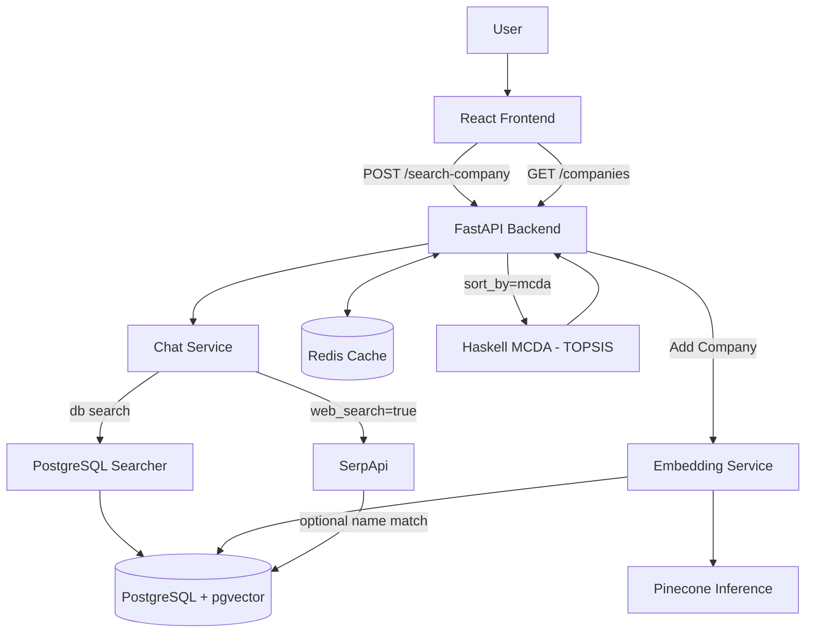

# Company Search & Ranking System with Hybrid Search


## Overview

This application implements an advanced company search and ranking system using a hybrid search approach that combines vector similarity search and traditional full-text search. The system uses PostgreSQL with PgVector extension for integrated storage. This approach ensures both semantic relevance and keyword accuracy in search results, making it particularly effective for company discovery and ranking.

## Description

The system leverages a sophisticated hybrid search architecture that:

- Uses Pinecone embeddings to convert company descriptions into vector representations
- Uses PostgreSQL with PgVector for vector search and storage
- Implements PostgreSQL's full-text search capabilities for keyword matching
- Combines both approaches with a weighted scoring system for optimal ranking
- Utilizes Groq's LLaMA models for intelligent search result processing and summarization
- Utilizes Redis for caching frequently accessed data to improve performance

This hybrid approach provides more accurate and contextually relevant results compared to traditional keyword-only search systems.

## Technologies Used

- **Backend**: FastAPI
- **Database**: PostgreSQL with pgvector extension, Redis for caching
- **Vector Embeddings**: Pinecone Inference API
- **LLM Processing**: Groq (tool-calling)
- **Web Search**: SerpApi (Google search)
- **MCDA Re‑ranking**: Haskell microservice (TOPSIS)
- **Frontend**: React + Tailwind CSS
- **Containerization**: Docker
- **ORM**: SQLAlchemy

## Haskell MCDA Ranking Service (TOPSIS)

The project includes a lightweight Haskell microservice that performs Multi‑Criteria Decision Analysis (MCDA) re‑ranking using the TOPSIS method. The backend can call this service to re‑order search results when the user selects the MCDA sort option.

### What it does

- Accepts a list of candidate companies with simple numeric features (e.g., `relevance`, `text`, `location`, `industry`) and optional weights.
- Returns the same candidates ranked by their MCDA score, plus a short explanation.

### Service location

- Code: `HaskellMCDA/`
- Default port: `8081`
- Backend env var for service URL: `MCDA_URL` (default: `http://mcda:8081` in Docker)

### API

- Endpoint: `POST /rank`
- Request (JSON):

```json
{
  "candidates": [
    {
      "id": 12,
      "features": {
        "relevance": 0.82,
        "text": 0.6,
        "location": 1,
        "industry": 1
      }
    },
    {
      "id": 7,
      "features": {
        "relevance": 0.76,
        "text": 0.75,
        "location": 0,
        "industry": 1
      }
    }
  ],
  "weights": {
    "relevance": 0.6,
    "text": 0.25,
    "location": 0.1,
    "industry": 0.05
  },
  "method": "topsis"
}
```

- Response (JSON):

```json
{
  "rankedCandidates": [
    { "id": 12, "score": 0.83 },
    { "id": 7, "score": 0.78 }
  ],
  "explanation": "Ranked using TOPSIS with weights: relevance:0.6, text:0.25, location:0.1, industry:0.05"
}
```

### How to run (Docker Compose)

- From the repository root (where `docker-compose.yml` lives):

```bash
docker-compose up --build -d
```

- This starts `mcda` (Haskell), `backend` (FastAPI), `frontend` (React), `db` (PostgreSQL/pgvector) and `redis`.
- The backend is configured with `MCDA_URL=http://mcda:8081` and will call MCDA when the frontend requests `sort_by=mcda`.

### How to run the Haskell service locally (dev)

Prerequisites: GHC + Cabal (install with `ghcup`), then:

```bash
cd HaskellMCDA
cabal update
cabal build
cabal run
```

- The service will start on `http://localhost:8081`.

### Quick test

With the service running locally:

```bash
curl -s http://localhost:8081/rank \
  -H 'Content-Type: application/json' \
  -d '{
        "candidates": [
          {"id": 1, "features": {"relevance": 0.9, "text": 0.6, "location": 1}},
          {"id": 2, "features": {"relevance": 0.7, "text": 0.8, "location": 0}}
        ],
        "weights": {"relevance": 0.6, "text": 0.3, "location": 0.1},
        "method": "topsis"
      }'
```

### Frontend/Backend integration

- Frontend: the search page has a “Sort” dropdown. Choose `MCDA` to request MCDA re‑ranking.
- Backend: `POST /search-company` accepts `sort_by`. When `sort_by=mcda`, it forwards candidates to the Haskell MCDA service and reorders the results. If the MCDA service is unavailable, the backend logs an error and falls back to the original order.

## Tests

- Backend (FastAPI): basic pytest unit tests live in `Backend/tests/`. Run: `cd Backend && python -m pytest -q`.
- Frontend (React): Jest + React Testing Library tests live in `Frontend/src/__tests__/` and component folders. Run: `cd Frontend && npm test -- --watchAll=false` (or `npm run test:coverage`).

## Key Features

- Hybrid search combining vector similarity and full-text search
- Real-time company ranking based on search relevance
- Company information management (add/search) and retrieval
- LLM powered tool calling
- Docker-based application deployment
- Pinecone embeddings
- Groq as LLM provider

## Getting Started

### Prerequisites

- Docker and Docker Compose
- Pinecone API key (for embeddings)
- Groq API key (for Groq LLM models)

### Environment Setup

1. Create a `.env` file in the Backend directory with the following variables:

   ```bash
   PINECONE_API_KEY=your_pinecone_api_key
   GROQ_API_KEY=your_groq_api_key
   SERP_API_KEY=your_serp_api_key
   ```

### Quick Start with Docker Compose

1. Clone the repository:

   ```bash
   git clone https://github.com/Syed007Hassan/Investment-Search.git
   cd Investment-Search
   ```

2. Build and start the containers:
   ```bash
   docker-compose up --build
   ```
3. Access the application:
   - Frontend: http://localhost:3000
   - Backend API: http://localhost:8000

### Database Setup Options

The application provides several options for database setup:

1. **Reset Database and Load Sample Data**:

   ```yaml
   command: >
     bash -c "
       python scripts/flush_redis.py &&
       python scripts/reset_db.py &&
       python scripts/load_data.py &&
       uvicorn main:app --host 0.0.0.0 --port 8000 --reload
     "
   ```

2. **Load Sample Data Only**:

   ```yaml
   command: >
     bash -c "
       python scripts/load_data.py &&
       uvicorn main:app --host 0.0.0.0 --port 8000 --reload
     "
   ```

3. **Start Application Only**:
   ```yaml
   command: uvicorn main:app --host 0.0.0.0 --port 8000 --reload
   ```

## Technical Implementation

### System Architecture

The system follows a service‑oriented architecture. Users search via the React frontend; the FastAPI backend orchestrates tool calls (DB search or Web search) through the Chat Service and optionally re‑ranks with the Haskell MCDA service. Results are cached in Redis.


```mermaid
flowchart TD
  U[User] --> FE[React Frontend]
  FE -->|"POST /search-company"| API[FastAPI Backend]
  FE -->|"GET /companies"| API

  API --> Chat[Chat Service]
  API <--> RC[(Redis Cache)]

  Chat -->|"web_search=true"| Serp[SerpApi]
  Chat -->|"db search"| PGS[PostgreSQL Searcher]
  PGS --> PG[(PostgreSQL + pgvector)]

  API -->|"Add Company"| Emb[Embedding Service]
  Emb --> Pine[Pinecone Inference]
  Emb --> PG

  API -->|"sort_by=mcda"| MCDA[Haskell MCDA - TOPSIS]
  MCDA --> API

  Serp -->|"optional name match"| PG
```

Flow highlights:

- Frontend can request database search or web search (`web_search=true`).
- When `sort_by=mcda`, backend sends candidates and weights to the Haskell MCDA service for re‑ranking.
- Responses (summary + ranked companies) are cached in Redis.

#### Architecture Components:

1. **Frontend Layer**: React-based user interface
2. **API Layer**: FastAPI backend with REST endpoints
3. **Service Layer**: Modular services for different functionalities
4. **Data Layer**: PostgreSQL with pgvector for storage and search
5. **External APIs**: Third-party services for embeddings and LLM processing

#### Data Flow:

**Adding Companies:**

1. Company data → PostgreSQL (with embeddings)

**Search Process:**

1. User query → Embedding generation
2. Vector search → PostgreSQL
3. Results → LLM processing
4. Final response → User

### Hybrid Search Architecture

The system implements a sophisticated hybrid search approach combining two powerful search methodologies with flexible vector database options:

1. **Vector Similarity Search (Semantic Search)**

   - Uses Pinecone's multilingual-e5-large model (1024-dimensional vectors)
   - Vector storage: PostgreSQL with pgvector extension (integrated approach)
   - Enables semantic understanding of search queries

2. **Full-Text Search (Keyword Search)**

   - Utilizes PostgreSQL's built-in full-text search capabilities
   - Performs exact and partial keyword matching

3. **Vector Database Configuration**
   - Uses PostgreSQL pgvector for vector search


### Demo Video


https://github.com/user-attachments/assets/01d9c8c1-63a1-401d-8b37-aebaf6e59ac7


