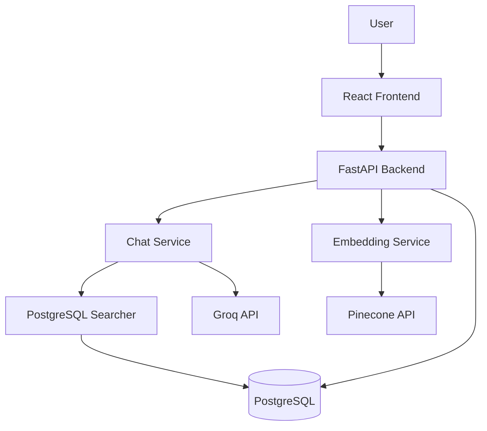

# Company Search & Ranking System with Hybrid Search


## Overview
This application implements an advanced company search and ranking system using a hybrid search approach that combines vector similarity search and traditional full-text search. The system uses PostgreSQL with PgVector extension for integrated storage. This approach ensures both semantic relevance and keyword accuracy in search results, making it particularly effective for company discovery and ranking.

## Description
The system leverages a sophisticated hybrid search architecture that:
- Uses Pinecone embeddings to convert company descriptions into vector representations
- Uses PostgreSQL with PgVector for vector search and storage
- Implements PostgreSQL's full-text search capabilities for keyword matching
- Combines both approaches with a weighted scoring system for optimal ranking
- Utilizes Groq's LLaMA models for intelligent search result processing and summarization
- Utilizes Redis for caching frequently accessed data to improve performance
 

This hybrid approach provides more accurate and contextually relevant results compared to traditional keyword-only search systems.

## Technologies Used
- **Backend**: FastAPI
- **Database**: PostgreSQL with pgvector extension, Redis for caching
- **Vector Embeddings**: Pinecone Inference API
- **LLM Processing**: Groq LLaMA models
- **Frontend**: React
- **Containerization**: Docker
- **ORM**: SQLAlchemy

## Haskell MCDA Ranking Service (TOPSIS)

The project includes a lightweight Haskell microservice that performs Multi‑Criteria Decision Analysis (MCDA) re‑ranking using the TOPSIS method. The backend can call this service to re‑order search results when the user selects the MCDA sort option.

### What it does
- Accepts a list of candidate companies with simple numeric features (e.g., `relevance`, `text`, `location`, `industry`) and optional weights.
- Returns the same candidates ranked by their MCDA score, plus a short explanation.

### Service location
- Code: `HaskellMCDA/`
- Default port: `8081`
- Backend env var for service URL: `MCDA_URL` (default: `http://mcda:8081` in Docker)

### API
- Endpoint: `POST /rank`
- Request (JSON):
```json
{
  "candidates": [
    { "id": 12, "features": { "relevance": 0.82, "text": 0.60, "location": 1, "industry": 1 } },
    { "id": 7,  "features": { "relevance": 0.76, "text": 0.75, "location": 0, "industry": 1 } }
  ],
  "weights": { "relevance": 0.6, "text": 0.25, "location": 0.1, "industry": 0.05 },
  "method": "topsis"
}
```
- Response (JSON):
```json
{
  "rankedCandidates": [
    { "id": 12, "score": 0.83 },
    { "id": 7,  "score": 0.78 }
  ],
  "explanation": "Ranked using TOPSIS with weights: relevance:0.6, text:0.25, location:0.1, industry:0.05"
}
```

### How to run (Docker Compose)
- From the repository root (where `docker-compose.yml` lives):
```bash
docker-compose up --build -d
```
- This starts `mcda` (Haskell), `backend` (FastAPI), `frontend` (React), `db` (PostgreSQL/pgvector) and `redis`.
- The backend is configured with `MCDA_URL=http://mcda:8081` and will call MCDA when the frontend requests `sort_by=mcda`.

### How to run the Haskell service locally (dev)
Prerequisites: GHC + Cabal (install with `ghcup`), then:
```bash
cd HaskellMCDA
cabal update
cabal build
cabal run
```
- The service will start on `http://localhost:8081`.

### Quick test
With the service running locally:
```bash
curl -s http://localhost:8081/rank \
  -H 'Content-Type: application/json' \
  -d '{
        "candidates": [
          {"id": 1, "features": {"relevance": 0.9, "text": 0.6, "location": 1}},
          {"id": 2, "features": {"relevance": 0.7, "text": 0.8, "location": 0}}
        ],
        "weights": {"relevance": 0.6, "text": 0.3, "location": 0.1},
        "method": "topsis"
      }'
```

### Frontend/Backend integration
- Frontend: the search page has a “Sort” dropdown. Choose `MCDA` to request MCDA re‑ranking.
- Backend: `POST /search-company` accepts `sort_by` and optional `weights`. When `sort_by=mcda`, it forwards candidates to the Haskell MCDA service and reorders the results. If the MCDA service is unavailable, the backend logs an error and falls back to the original order.

## Key Features
- Hybrid search combining vector similarity and full-text search
- Real-time company ranking based on search relevance
- Company information management (add/search) and retrieval
- LLM powered tool calling
- Docker-based application deployment
- Pinecone embeddings
- Groq as LLM provider

## Getting Started

### Prerequisites
- Docker and Docker Compose
- Pinecone API key (for embeddings)
- Pinecone API key (for Pinecone embeddings)
- Groq API key (for Groq LLM models)
 

### Environment Setup

1. Create a `.env` file in the Backend directory with the following variables:
   ```bash
   DATABASE_NAME=your_database_name
   DATABASE_USER=your_database_user
   DATABASE_PASSWORD=your_database_password
   DATABASE_URL=localhost
   DATABASE_PORT=5432
   PINECONE_API_KEY=your_pinecone_api_key
   GROQ_API_KEY=your_groq_api_key
   
   ```

### Quick Start with Docker Compose

1. Clone the repository:
   ```bash
   git clone https://github.com/Syed007Hassan/Investment-Search.git
   cd Investment-Search
   ```

2. Build and start the containers:
   ```bash
   docker-compose up --build
   ```
3. Access the application:
   - Frontend: http://localhost:3000
   - Backend API: http://localhost:8000

### Database Setup Options

The application provides several options for database setup:

1. **Reset Database and Load Sample Data**:
   ```yaml
   command: >
     bash -c "
       python scripts/reset_db.py &&
       python scripts/load_data.py &&
       uvicorn main:app --host 0.0.0.0 --port 8000 --reload
     "
   ```

2. **Load Sample Data Only**:
   ```yaml
   command: >
     bash -c "
       python scripts/load_data.py &&
       uvicorn main:app --host 0.0.0.0 --port 8000 --reload
     "
   ```

3. **Start Application Only**:
   ```yaml
   command: uvicorn main:app --host 0.0.0.0 --port 8000 --reload
   ```

## Technical Implementation

### System Architecture

The system follows a microservices architecture with PostgreSQL as the vector database:


```mermaid
graph TB
    U[User] --> FE[React Frontend]
    FE --> API[FastAPI Backend]
    
    API --> CS[Chat Service]
    API --> ES[Embedding Service]
    
    CS --> PS[PostgreSQL Searcher]
    
    PS --> PG[(PostgreSQL)]
    
    ES --> PA[Pinecone API]
    CS --> GR[Groq API]
    
    API --> PG
```

#### Architecture Components:

1. **Frontend Layer**: React-based user interface
2. **API Layer**: FastAPI backend with REST endpoints
3. **Service Layer**: Modular services for different functionalities
4. **Data Layer**: PostgreSQL with pgvector for storage and search
5. **External APIs**: Third-party services for embeddings and LLM processing

#### Data Flow:

**Adding Companies:**
1. Company data → PostgreSQL (with embeddings)

**Search Process:**
1. User query → Embedding generation
2. Vector search → PostgreSQL
3. Results → LLM processing
4. Final response → User

### Hybrid Search Architecture

The system implements a sophisticated hybrid search approach combining two powerful search methodologies with flexible vector database options:

1. **Vector Similarity Search (Semantic Search)**
   - Uses Pinecone's multilingual-e5-large model (1024-dimensional vectors)
   - Vector storage: PostgreSQL with pgvector extension (integrated approach)
   - Enables semantic understanding of search queries

2. **Full-Text Search (Keyword Search)**
   - Utilizes PostgreSQL's built-in full-text search capabilities
   - Performs exact and partial keyword matching

3. **Vector Database Configuration**
   - Uses PostgreSQL pgvector for vector search

### Embedding Options

**Pinecone Embeddings**
- Model: multilingual-e5-large
- Dimensions: 1024
- Advantages: Multilingual support, open-source model, cost-effective

### LLM Processing Options

For search result processing and summarization, the system supports:

**Groq LLaMA Models**
  - Model: llama-3.3-70b-versatile
  - Advantages: Fast inference, cost-effective, open-source architecture

### Search & Ranking Process

Let's break down this hybrid search query step by step:

1. **First CTE (Common Table Expression) - Vector Search:**
   ```sql
   WITH vector_search AS (
       SELECT id, 
              RANK () OVER (ORDER BY embedding <=> :embedding) AS rank
       FROM "Company"
       ORDER BY embedding <=> :embedding
       LIMIT 20
   )
   ```
   - Creates a temporary result set named `vector_search`
   - `embedding <=> :embedding`: Calculates cosine distance between stored embeddings and query embedding
   - `RANK() OVER`: Assigns ranks based on similarity (lower distance = better rank)
   - `LIMIT 20`: Takes top 20 most similar vectors
   - Vector distance ranges from 0-2, where 0 means vectors are identical and 2 means opposite

2. **Second CTE - Full-text Search:**
   ```sql
   fulltext_search AS (
       SELECT id, 
              RANK () OVER (ORDER BY ts_rank_cd(to_tsvector('english', content), query) DESC) 
       FROM "Company", 
            plainto_tsquery('english', :query) query
       WHERE to_tsvector('english', content) @@ query
       ORDER BY ts_rank_cd(to_tsvector('english', content), query) DESC
       LIMIT 20
   )
   ```
   - Creates another temporary result set named `fulltext_search`
   - `to_tsvector('english', content)`: Converts content to searchable tokens
   - `plainto_tsquery('english', :query)`: Converts search query to search terms
   - `@@`: Text search match operator
   - `ts_rank_cd`: Calculates text search relevancy score (higher score means better match)
   - `LIMIT 20`: Takes top 20 best text matches

3. **Final Combined Query:**
   ```sql
   SELECT
       COALESCE(vector_search.id, fulltext_search.id) AS id,
       COALESCE(1.0 / (:k + vector_search.rank), 0.0) +
       COALESCE(1.0 / (:k + fulltext_search.rank), 0.0) AS score
   FROM vector_search
   FULL OUTER JOIN fulltext_search ON vector_search.id = fulltext_search.id
   ORDER BY score DESC
   LIMIT 20
   ```
   - `FULL OUTER JOIN`: Combines results from both searches, keeping all matches from either
   - `COALESCE` for IDs: Ensures we capture matches from either search method
   - `COALESCE` for scoring: Handles cases where an item only matches one search type (defaults to 0)
   - Score calculation uses k=60 as normalization factor to:
     - Prevent division by zero
     - Normalize scores to a comparable range
     - Reduce impact of small rank differences
   - `ORDER BY score DESC`: Ranks final results by combined score
   - `LIMIT 20`: Returns top 20 combined results

**Ranking Process:**
1. Vector ranking:
   - Lower cosine distance = better rank
   - Score = 1/(60 + rank)
   - Example: Rank 1 = 1/61 ≈ 0.0164
   - Lower distance is better because:
     - Cosine distance measures how far apart two vectors are in high-dimensional space
     - Distance of 0: Vectors are identical (perfect semantic match)
     - Distance of 1: Vectors are perpendicular (unrelated content)
     - Distance of 2: Vectors point in opposite directions (opposite meaning)
     - Therefore, smaller distances indicate closer semantic similarity

2. Text ranking:
   - Higher ts_rank_cd = better rank
   - Score = 1/(60 + rank)
   - Example: Rank 2 = 1/62 ≈ 0.0161
   - Higher ts_rank_cd is better because:
     - It counts the number of matching terms
     - Considers term frequency (how often terms appear)
     - Weighs term proximity (how close terms are to each other)
     - Accounts for term importance in the document
     - Therefore, more matches and better quality matches result in higher scores

3. Final ranking:
   - Combined score = vector_score + text_score
   - Higher combined score = better overall match
   - Normalization ensures fair combination despite different scoring scales

### Example
Consider the following example to illustrate the ranking process:

- Item A: vector_rank=1, text_rank=2
  - Score = 1/61 + 1/62 ≈ 0.0328
- Item B: vector_rank=5, text_rank=1
  - Score = 1/65 + 1/61 ≈ 0.0317
- Result: Item A ranks higher than Item B

This hybrid approach ensures that results are ranked considering both semantic similarity (vectors) and keyword relevance (text), providing a more comprehensive search result.

### Demo

https://github.com/user-attachments/assets/bce8fc3b-45ef-4ae7-b94e-aad6b4dcc089

 


